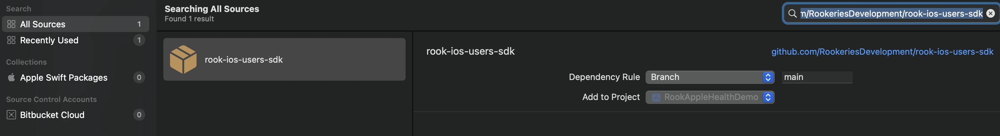

# RookUserSDK

This SDK allows the [client](https://docs.tryrook.io/docs/Definitions/#client) to register their [Users](https://docs.tryrook.io/docs/Definitions/#User) in ROOK server.

## Features

* Register Users in Health Connect
* Fetch the user id stored locally.

## Installation

To add a package dependency to your Xcode project, select File > Swift Packages > Add Package Dependency and enter the repository URL [https://github.com/RookeriesDevelopment/rook-ios-users-sdk](https://github.com/RookeriesDevelopment/rook-ios-users-sdk)



## Getting started

To configure Rook Users, you need to follow this steps:

1. Import th apple health sdk

```swift
import RookConnectTransmission
import RookUsersSDK
```

 2. Add your credentials. 
 - This method should be called at the beginning of your app's launch process.

```swift
func application(_ application: UIApplication
                 didFinishLaunchingWithOptions launchOptions: [UIApplication.LaunchOptionsKey : Any]? = nil) -> Bool {
    
    RookUsersConfiguration.shared.setConfiration(
      clientUUID: "9593d0ec-2222-3333-444-10d3f4f43127",
      secretKey: "YdwdwQ3mP0zey5nZ9w3WHQMfijewjslfjleis")
    
    
    RookUsersConfiguration.shared.initRookUsers() { _ in }
    return true
}
```

## Usage

### RookUserConfiguration

`RookUserConfiguration` configures the sdk and init before start using it.
This class conforms the singleton pattern, use the shared property to access it.

| Function | Description |
| -------- | ----------- |
| `setConfiguration(urlAPI: String, clientUUID: String, secretKey: String)` | Sets the configuration with  your `clientUUID` and `secreteKey` parameters |
| `setEnvironment(_ environment: RookUsersEnvironment)` | Sets the configuration to the environment given. |
| `initRookUsers(completion: @escaping (Result<Bool, Error>) -> Void)` | Initializes the sdk and validates if the credentials are correct |

**Note: remember to set the environment, If the environment is not set, the sdk will work in sandbox**

Create an instance of `RookUserManager`

```swift
private let userManager: RookUsersManger = RookUsersManger()
```

### Registering Users

To register a User call `registerRookUser` providing a userID.
 After a successful registration it will store a `RookUser`

The `userID` is defined by you, so feel free to use the same ID your app uses to identify it's
Users. If you provide an ID which is already exists in the server it will only store it.

```swift
func addUserToAppleHealth() {
    let userId: String = "paco@tryrook.io"
    userManager.registerRookUser(with: userId) { result in
      switch result {
      case .success(let success):
        debugPrint("user added successfully \(success)")
      case .failure(let failure):
        debugPrint("error while adding a user \(failure)")
      }
    }
  }
```

### Removing registered Users from local storage

This SDK already manages the case were you need to register a different userID (the new userID
will replace the previous one).

If you want to manually remove a userID call `removeUser` 

```swift
func removeUser() {
    userManager.removeUser() { result in
      switch result {
      case .success(let success):
        debugPrint("user deleted")
      case .failure(let failure):
        debugPrint("error while removing user \(failure)")
      }
    }
  }
```

* `removeUser` will only delete from local storage, the User will remain registered
  on server.

## Additional information

The first time your Users use this SDK they MUST have an active internet connection otherwise
the request will fail and the userID won't be registered or stored.
